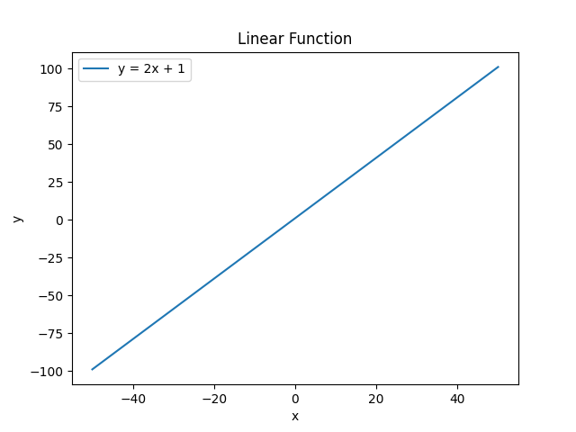
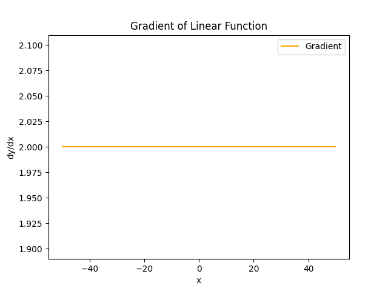
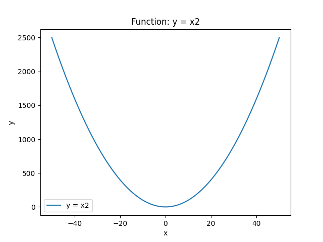
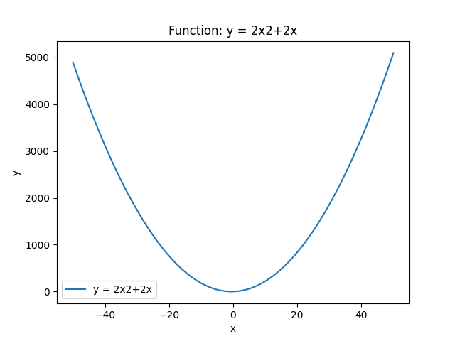
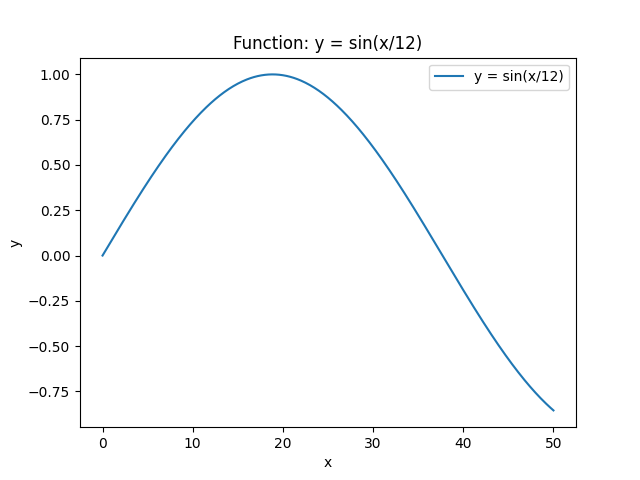

# Two-dimensional arrays and gradient problems

---

### **Purpose**
- Practice working with NumPy for numerical computations.
- Learn to calculate gradients and visualize functions.
- Explore linear, quadratic, and trigonometric functions in a structured, step-by-step assignment.
- Understand array combination, gradient computation, plotting, and minimum value extraction.

---

### **Problem Description**
- In machine learning and numerical analysis, gradients help us find the **rate of change** and **minimum values** of functions.
- This assignment involves **linear, quadratic, and sinusoidal functions**, calculating gradients, plotting them, and finding minimum points.
- Results are saved as plots so users can preview outputs directly on GitHub.

---

## Assignments

### **[Problem 1] Linear Function**
- Generate `x` values from -50 to 50 with step 0.1.
- Compute `y = 2x + 1`.
- Preview first 5 points:

```

x = [-50.0, -49.9, -49.8, -49.7, -49.6]
y = [-99.0, -98.8, -98.6, -98.4, -98.2]

```

---

### **[Problem 2] Combine Arrays**
- Combine `x` and `y` from Problem 1 into a 2D array of shape `(1001, 2)`:

```

[[-50.0, -99.0],
[-49.9, -98.8],
[-49.8, -98.6],
[-49.7, -98.4],
[-49.6, -98.2]]

```

---

### **[Problem 3] Gradient Calculation**
- Compute `dy/dx` using differences between adjacent points.
- Gradient for the linear function is constant:

```

First 5 gradients: [2.0, 2.0, 2.0, 2.0, 2.0]

````

---

### **[Problem 4] Plot Linear Function & Gradient**
- Visualize the linear function and its gradient.
- **Linear Function Plot**:  
    
- **Gradient Plot**:  
  

---

### **[Problem 5] Functionalization & Multiple Functions**
- Functions evaluated:  
  1. `y = x²` →   
  2. `y = 2x² + 2x` →   
  3. `y = sin(x/12)` →   
- Each function is computed at 0.1 intervals.
- Gradients calculated internally to understand slope changes.

---

### **[Problem 6] Minimum Value**
- Find the minimum `y` for each function using `ndarray.min()` and `argmin()`.
- Display slopes before and after minimum points.

| Function        | Min x | Min y  | Slope Before | Slope After |
|-----------------|-------|--------|--------------|-------------|
| y = x²          | 0.0   | 0.0    | None         | 0.008       |
| y = 2x²+2x      | -0.5  | -0.5   | -1.0         | 0.0         |
| y = sin(x/12)   | 18.85 | -0.99  | 0.09         | 0.09        |

---

### **Tools Used**
- Python
- NumPy
- Matplotlib

---

### **How to Run**
1. Clone or download the repository.
2. Install dependencies:

```bash
pip install -r requirements.txt
````

3. Run all problem scripts:

```bash
python main.py
```

* Plots and array previews will be generated automatically in `outputs/`.

---

### **Folder Structure**

```
### **Folder Structure**

array-gradient-problem/
│ .gitignore
│ main.py
│ README.md
│ requirements.txt
│
├───notebooks
│ problem1.ipynb
│ problem2.ipynb
│ problem3.ipynb
│ problem4.ipynb
│ problem5.ipynb
│ problem6.ipynb
│
├───outputs
│ problem4_gradient.png
│ problem4_linear.png
│ problem5_2x2_2x.png
│ problem5_sin.png
│ problem5_x2.png
│
└───src
│ problem1_linear.py
│ problem2_array.py
│ problem3_gradient.py
│ problem4_plot.py
│ problem5_functions.py
│ problem6_minimum.py
│ problem6_minimum.pyclear

```

---

## Author

**Assignment:** Array Gradient Problem

**Name:** Victor Karisa

**Date:** 27/09/2025
